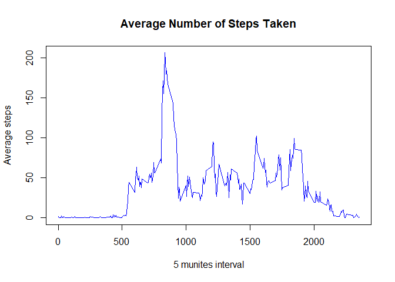

#### **Initial setting**  

```r
library(lattice)
library(tidyverse)
```

```
## -- Attaching packages --------------------------------------- tidyverse 1.3.1 --
```

```
## v ggplot2 3.3.5     v purrr   0.3.4
## v tibble  3.1.4     v dplyr   1.0.7
## v tidyr   1.1.4     v stringr 1.4.0
## v readr   2.0.2     v forcats 0.5.1
```

```
## -- Conflicts ------------------------------------------ tidyverse_conflicts() --
## x dplyr::filter() masks stats::filter()
## x dplyr::lag()    masks stats::lag()
```

## 1. Loading and preprocessing the data  
Show any code that is needed to  
1-1: Load the data (i.e. read.csv())  
1-2: Process/transform the data into a format suitable for the analysis 

#### **1-1 and 1-2: Load the data, process/transform the data**  

```r
setwd("~/coursera/JHU_reproducible/WK2/Assignment/")
myData0 <- read.csv("activity.csv") %>%
        mutate(date = as.Date(date))
```
- The original data, "activity.csv" was read by "read.csv()", and transformed into "myData0"(initial data).  
- Then, the class of the variable "date" was transformed from "character" to "date" for the later usage.  
(Assignment 1-1 and 1-2 completed.)  

## 2. What is mean total number of steps taken per day?  
2-1: Calculate the total number of steps taken per day  
2-2: Make a histogram of the total number of steps taken each day  
2-3: Calculate and report the mean and median of the total number of steps taken per day  

#### **2-1: Total number of steps taken per day**  

```r
myData1 <- myData0 %>%
        group_by(date) %>%
        summarize(dailyTotal = sum(steps))
```
- Initial data "myData0" was grouped by "date" and total number of steps taken per day was caluculated and loaded into "myData1"  
- Total number of steps taken per day (myData1$dailyTotal):  
NA, 126, 11352, 12116, 13294, 15420, 11015, NA, 12811, 9900, 10304, 17382, 12426, 15098, 10139, 15084, 13452, 10056, 11829, 10395, 8821, 13460, 8918, 8355, 2492, 6778, 10119, 11458, 5018, 9819, 15414, NA, 10600, 10571, NA, 10439, 8334, 12883, 3219, NA, NA, 12608, 10765, 7336, NA, 41, 5441, 14339, 15110, 8841, 4472, 12787, 20427, 21194, 14478, 11834, 11162, 13646, 10183, 7047, NA  
(Assignment completed.)  

#### **2-2: Histogram of the total number of steps taken each day**  

```r
hist(myData1$dailyTotal, breaks = seq(0, 25000, 1000), 
     col = "blue", 
     main = "Histogram - daily total # of steps",
     xlab = "daily total number of steps")
```

<!-- -->

- Histogram was created by myData1$dailyTotal.  
- The histogram simply ignores the date which contains NAs.  
(Assignment completed.)  

#### **2-3: Mean and median of the total number of steps taken per day**  

```r
myMean <- mean(myData1$dailyTotal, na.rm = TRUE)
myMedian <- median(myData1$dailyTotal, na.rm = TRUE)
```
- Mean and median number of steps taken each day was calculated by "myMean" and "myMedian", respectively.  
- mean: 1.0766189\times 10^{4}  
- median: 10765  
(Assignment completed.)  

## 3. What is the average daily activity pattern?  
3-1: Make a time series plot (i.e. type = "l") of the 5-minute interval (x-axis) and the average number of steps taken, averaged across all days (y-axis)  
3-2: Which 5-minute interval, on average across all the days in the dataset, contains the maximum number of steps?  

#### **3-1: Time series plot of 5-minute interval**  

```r
myData2 <- myData0 %>%
        group_by(interval) %>%
        summarize(meanSteps = mean(steps, na.rm = TRUE))
plot(x = myData2$interval, y = myData2$meanSteps, 
     type = "l", col = "blue",
     main = "Average Number of Steps Taken",
     xlab = "5 munites interval",
     ylab = "Average steps")
```

<!-- -->

- "myData0" was transformed by grouped by interval, then steps of each interval were averaged across the period.  
- The result was plotted as time series, using type, "l".  
(Assignment completed.)  

#### **3-2: Maximum number of steps**  

```r
myMaxInterval <- filter(myData2, meanSteps == max(meanSteps))[1]
myMaxIntervalValue <- filter(myData2, meanSteps == max(meanSteps))[2]
```
- Interval on average that contains the maximum number of steps was found by "max(meanSteps)": 835  
- The maximum number of steps (myMaxIntervalValue): 206.1698113  
(Assignment completed.)  

## 4. Imputing missing values  
4-1: Calculate and report the total number of missing values in the dataset (i.e. the total number of rows with NAs)  
4-2: Devise a strategy for filling in all of the missing values in the dataset.   
4-3: Create a new dataset that is equal to the original dataset but with the missing data filled in.  
4-4: Make a histogram of the total number of steps taken each day and Calculate and report the mean and median total number of steps taken per day. Do these values differ from the estimates from the first part of the assignment? What is the impact of imputing missing data on the estimates of the total daily number of steps?  

#### **4-1: Total number of missing values**  

```r
myData3 <- myData0 %>%
        mutate(isna = is.na(steps)) %>%
        filter(isna == TRUE)
myMissingValues <- nrow(myData3)
```
- "myData3" consists of data that includes only NAs for "steps".  
- Total number of missing values in the dataset(myMissingValues): 2304  
(Assignment completed.)  

#### **4-2: Strategy(step-1)**  

```r
modelData <- myData0 %>%
        mutate(wkdays = weekdays(date)) %>%
        group_by(wkdays, interval) %>%
        summarise(mean = mean(steps, na.rm = TRUE)) %>%
        mutate(index = paste(wkdays, interval)) %>%
        select(index, mean)
```

```
## `summarise()` has grouped output by 'wkdays'. You can override using the `.groups` argument.
```

```
## Adding missing grouping variables: `wkdays`
```
- Initial data, "myData0" was grouped by wkdays and interval. Under the condition above, the average of steps in each interval across the period, after removing the NAs, was calculated and named as "modelData". 
- Note that "index" was created by combining "wkdays" and "interval" so that it would be used as a key to link modelData and initial data.  
- The modelData is used to fill the NAs in the initial data.  

#### **4-2: Strategy(step-2)**  

```r
myData4 <- myData0 %>%
        mutate(wkdays = weekdays(date)) %>%
        mutate(index = paste(wkdays, interval))
```
- myData4 is set to replace NAs by modelData in the next step.   

#### **4-2: Strategy(step-3)**

```r
f <- function() {
        for (i in 1:nrow(myData4)) {
                if(is.na(myData4$steps[i]) == TRUE) {
                        modelData_Matched <- filter(modelData, 
                                                    index == myData4$index[i])
                        myData4$steps[i] <<- modelData_Matched$mean[1]
                }
        }        
        invisible(myData4)
}
f()
```
- A function f() is used to replace the NAs in myData4$steps by modelData with regard to the same "index".  
(Assignment completed.)  

#### **4-3: New dataset**  

```r
myData4Output <- select(myData4, -wkdays, -index)
head(myData4Output)
```

```
##      steps       date interval
## 1 1.428571 2012-10-01        0
## 2 0.000000 2012-10-01        5
## 3 0.000000 2012-10-01       10
## 4 0.000000 2012-10-01       15
## 5 0.000000 2012-10-01       20
## 6 5.000000 2012-10-01       25
```

```r
str(myData4Output)
```

```
## 'data.frame':	17568 obs. of  3 variables:
##  $ steps   : num  1.43 0 0 0 0 ...
##  $ date    : Date, format: "2012-10-01" "2012-10-01" ...
##  $ interval: int  0 5 10 15 20 25 30 35 40 45 ...
```
- New dataset that is equal to the original dataset but with the missing data filled in.  
- New dataset is shown by using head() and str().  
(Assignment completed.)  

#### **4-4: Checking the validity of myData4**  

```r
myData5 <- mutate(myData4, isna = is.na(steps), count = 1) %>%
        group_by(date) %>%
        summarize(dailyTotal = sum(steps, na.rm = TRUE),
                  dailyNAs = sum(isna))
        totalDailyNAs <- unique(myData5$dailyNAs)
```
- To check the validity of myData4, myData5 was created.
- myData5 is the daily total steps and number of NAs.  
- Number of daily NAs is checked by unique().  
- Number of daily NAs (totalDailyNAs): 0(should be zero)  
- Since the unique number of totalDailyNAs is zero, myData4 is valid. 

#### **4-4: Histogram(after imputing) and comparison(before/after)**  

```r
par(mfrow = c(1, 2))
hist(myData5$dailyTotal, breaks = seq(0, 25000, 1000),
     col = "skyblue",
     main = "Daily total number of steps \n(NAs imputed)",
     xlab = "daily total number of steps")

hist(myData5$dailyTotal, breaks = seq(0, 25000, 1000),
     col = "skyblue",
     main = "Comparison \n(Original overplotted)",
     xlab = "daily total number of steps")
hist(myData1$dailyTotal, breaks = seq(0, 25000, 1000),
     col='blue', add=TRUE)
```

<!-- -->

- Histgram after NAs imputation (left), and comparison of the before/after the imputation (right).  
- The before imputation chart is overwritten as "bule".  
- Note the difference(increase in after imputation is displayed as "skyblue").  

#### **4-4: Mean & median total number of steps (after NAs imputation)**  

```r
myMeanNew <- mean(myData5$dailyTotal, na.rm = TRUE)
myMedianNew <- median(myData5$dailyTotal, na.rm = TRUE)
```
**(After NAs imputation)**  
mean: 1.082121\times 10^{4}  
median: 1.1015\times 10^{4}  

**(Before NAs imputation)**  
mean: 1.0766189\times 10^{4}  
median: 10765  

**(After - Before imputation)**  
mean: 55.0209226  
median: 250  

- After imputation, mean and median values differ from before imputation values.  
- The impact of imputing missing data is the increase of the mean (by 55 steps) and median (by 250 steps).  
(Assignment completed.)  

## 5. Are there differences in activity patterns between weekdays and weekends?  
5-1: Create a new factor variable in the dataset with two levels – “weekday” and “weekend” indicating whether a given date is a weekday or weekend day.  
5-2: Make a panel plot containing a time series plot (i.e. type = "l") of the 5-minute interval (x-axis) and the average number of steps taken, averaged across all weekday days or weekend days (y-axis).   

#### **Preparation (Function to divide weekend and weekday)**    

```r
f2 <- function(x) {
        if (x == "土曜日" | x == "日曜日"){output <- "weekend"}
        else {output <- "weekday"}
        return(output)
}
```
- Created function f2() that returns "weekend" or "weekday".  
- **Please note that "土曜日" and "日曜日" means "Saturday" and "Sunday", respectively in my R system environment.** 

#### **5-1: Create factor variable (“weekday” and “weekend”)**  

```r
wkendOrNot <- lapply(myData4$wkdays, function(x) f2(x))
myData4 <- mutate(myData4, wkendOrNot = wkendOrNot)
myData4_weekend <- myData4 %>%
        filter(wkendOrNot == "weekend") %>%
        group_by(interval) %>%
        summarize(meanSteps = mean(steps, na.rm = TRUE)) %>%
        mutate(wkendOrNot = "weekend")
myData4_weekday <- myData4 %>%
        filter(wkendOrNot == "weekday") %>%
        group_by(interval) %>%
        summarize(meanSteps = mean(steps, na.rm = TRUE)) %>%
        mutate(wkendOrNot = "weekday")
myData4 <- rbind(myData4_weekend, myData4_weekday)
```
- myData4 is divided to myData4_weekend and myData4_weekday, according to the categorical variable, wkendOrNot, and grouped by interval.   
- For each "myData4_weekend" and "myData4_weekday", mean steps by interval was calculated
- To make panel plot, two category was merged vertically by rbind().  
(Assignment completed.)  

#### **5-2: Panel plot**  

```r
xyplot(meanSteps ~ interval | wkendOrNot, myData4, 
       type = "l", layout=c(1,2))
```

<!-- -->

- Panel plots were created by xyplot().  
- There are differences in activity pattern between weekdays and weekends. Weekends is more active throughout the day than weekdays, that has a peak in the earlier time of the day.  
(Assignment completed.)
